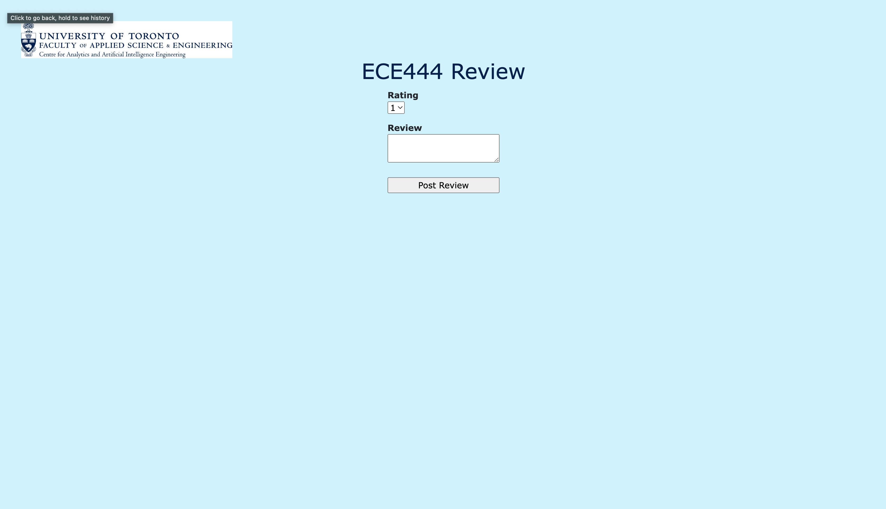
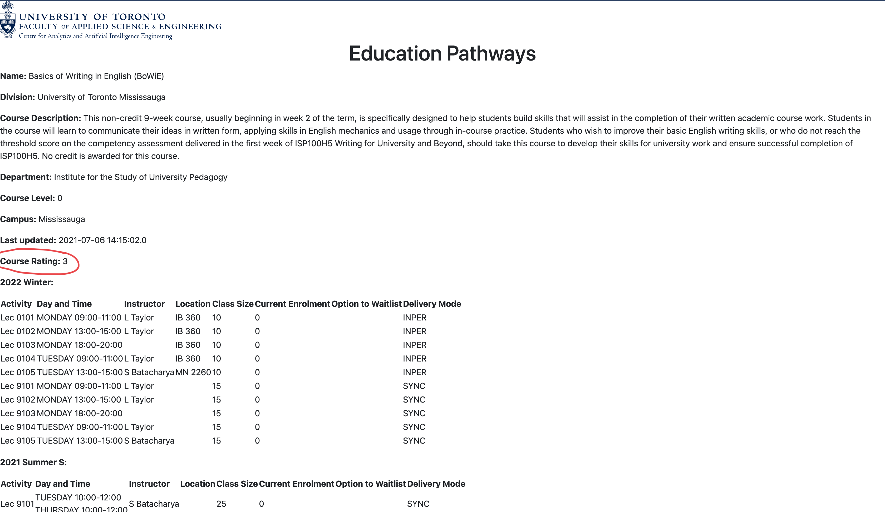

# This repo is a clone of https://github.com/nelaturuk/education_pathways
## Names: Eric Liang, Nathan Coelho, Navid Pour

## Acitivty 1 </r>

## Activity 2-5 </r>
### Home Page </r>

### Results Page - Form </r>

### Results Page - Results Table </r>

## Activity 6 </r>
### User Story 1: Course Filter

### User Story 2: Post Review Page </r>

### User Story 3: Course Description Review </r>

